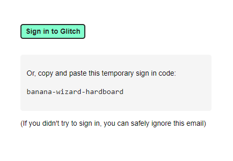

# glitchapi.js

## ⚠️ Important Information ⚠️

Do not store insecurely or share the **persitent token** or the **temporary login code**. As far as I know, **Glitch does not refresh the token in anyway or the login code**. The only way to refresh the login code is by requesting a new one.

Doing so puts your account at **risk** and potentially your **private information**.

## Install

```bash
npm install glitchapi.js
```

## General Examples

### Get Project By ID or Name

```js
const Glitch = require('glitchapi.js');
(async () => {
    // Get project by domain name
    console.log(await Glitch.getProject("domain", "stay-safe-discord"));
    // Get project by id
    console.log(await Glitch.getProject("id", "e292e1a7-9130-4150-abd3-90b893a95858"));
})()
```

### Get User by ID or Login/@

```js
const Glitch = require('glitchapi.js');
(async () => {
    // Get project by domain name
    console.log(await Glitch.getUser("login", "Zaedus"));
    // Get project by id
    console.log(await Glitch.getUser("id", 2643102));
})()
```

## Logged in User Examples

### Getting a login token

```js
const Glitch = require('glitchapi.js');

Glitch.emailTempCode("youremail@gmail.com");
```

Check your email and you will find your code.



#### MAKE SURE YOU STORE IT SECURELY

### Logging in

Creates a `Me` instance.

```js
const Glitch = require('glitchapi.js');

const me = new Glitch.Me();

me.on("ready", () => {
    console.log(`${me.name} (@${me.login})`) // Zaedus (@Zaedus)
})

me.signin("your-code-here")
```

### Setting User Data

Sets various attributes about the user's account like the name, @, and description.

```js
const Glitch = require('glitchapi.js');

const me = new Glitch.Me();

me.on("ready", async () => {
    await me.update({
        avatarUrl: "https://i.ytimg.com/vi/YBXLVex9FtQ/maxresdefault.jpg", // Must be an online URL
        description: "This discription was set with API!", // Sets your description
        hasCoverImage: true, // Shows or hides the background image
        name: "MyNewName", // Sets your display name
        login: "MyNewAt" // Sets your @
    })
    console.log("User data updated!");
})

me.signin("your-code-here")
```

### Creating a Project

Creates a new projects called "my-new-express-app".

```js
const Glitch = require('glitchapi.js');

const me = new Glitch.Me();

me.on("ready", async () => {
    await me.remix("hello-express", {
        domain: "my-new-express-app",
        description: "My new express app!",
        private: false
    })
    console.log("New project created!");
})

me.signin("your-code-here")
```

### Getting Your Projects

Gets 10 projects and logs the URL associated with them.

```js
const Glitch = require('glitchapi.js');

const me = new Glitch.Me();

me.on("ready", async () => {
    const projects = await me.getProjects(10);
    projects.forEach(p => {
        console.log("https://" + p.domain + ".glitch.me/");
    });
})

me.signin("your-code-here")
```

### Updating Project Data

```js
const Glitch = require('glitchapi.js');

const me = new Glitch.Me();

me.on("ready", async () => {
    const projects = await me.getProjects(10);
    await projects[0].update({
        domain: "my-new-domain",
        description: "Successfully updated!"
    })
    console.log("Project updated!");
})

me.signin("your-code-here")
```

### Project Deletion/Undeletion

```js
const Glitch = require('glitchapi.js');

const me = new Glitch.Me();

me.on("ready", async () => {
    const projects = await me.getProjects(10);
    projects[0].delete();
    setTimeout(() => projects[0].undelete(), 2000);
})

me.signin("your-code-here")
```
